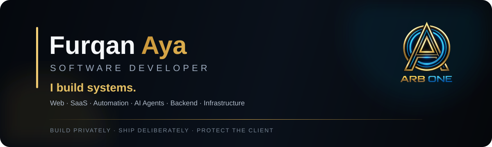

<div align="center">



[Website](https://arb.one) · [Telegram](https://t.me/Arb_skin) · [GitHub](https://github.com/FurqanAya)

</div>

---

## About

I am a software developer with experience across multiple programming languages, platforms, and generations of web development.

My work ranges from **WordPress themes, custom websites and practical scripts** to **modern SaaS platforms, backend services, APIs, automation systems and AI-powered software**.

I focus on building software that is useful, maintainable, scalable, and designed around the actual problem rather than a particular technology.

## Technology Stack

<div align="center">

### Languages


### Web & Frameworks


### Databases & Data


### Infrastructure & Tooling


</div>

> SQL · REST APIs · Multi-Tenant SaaS · AI Agents · Agent Orchestration · Workflow Automation · Telegram Bot Development · Local AI · System Integration

## What I Build

| Area | Experience |
| --- | --- |
| Web Development | Custom websites, web applications and reusable web solutions |
| WordPress | Themes, custom implementations and WordPress-based solutions |
| Scripts & Automation | Utility scripts, workflow automation and system integrations |
| Telegram Bots | Bot development, automation, integrations, channel workflows and backend services |
| SaaS | Multi-tenant platforms, product architecture and backend systems |
| Backend & APIs | Services, REST APIs, integrations and data workflows |
| AI | AI-powered applications, agents, orchestration and local AI workflows |
| Infrastructure | Linux environments, Docker-based services and deployment workflows |

## Focus

```text
Scalable Web Platforms     SaaS Architecture
AI Agents                  Automation Systems
Backend Services           APIs & Integrations
Databases                  Containers & Infrastructure
Linux Systems              Developer Tooling
```

## Principles

- Build systems that remain understandable as they grow.
- Prefer clear architecture over accidental complexity.
- Automate repeatable work without sacrificing control.
- Keep infrastructure reproducible and observable.
- Treat security, data integrity, and maintainability as design requirements.
- Use the right language and tool for the system being built.

## Private Work

Most of my professional work is intentionally kept private.

Many of the systems, platforms, scripts, and solutions I build are developed for clients or private products and are not published publicly on GitHub. Protecting client privacy, proprietary code, business logic, infrastructure details, and confidential project information takes priority over maintaining a large public repository portfolio.

Public repositories represent only a small part of my development work.

## Arb One

I build and develop software under **Arb One**, focused on scalable digital platforms, automation, AI-assisted systems, and long-lived software products.

**Website:** [arb.one](https://arb.one)

---

<div align="center">

**Furqan Aya**  
Software Developer · Arb One

[Website](https://arb.one) · [Telegram](https://t.me/Arb_skin) · [GitHub](https://github.com/FurqanAya)

</div>
